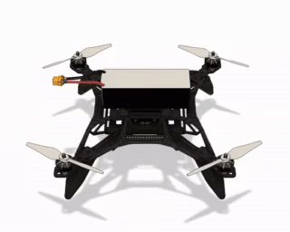
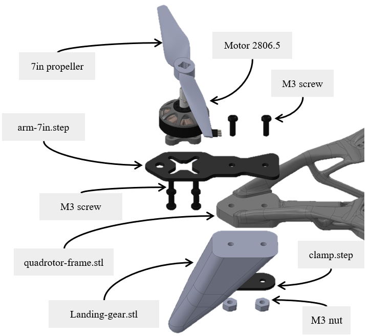

# Modular Quadrotor

This repository contains the files necessary for building the quadrotor presented in the paper called "Simplifying Quadrotor Frame Design: Toward Scalability with a Modular Robot". The ultimate objective is to improve reproducibility in aerial robotics, by providing a modular robot. It can be manufactured easily and adapted to any research need. 

Freeflight           |  Quadrotor components
:-------------------------:|:-------------------------:
  |  

## Key Features
- *Lightweight Structure*: Optimized design reduces the frame's overall weight, enhancing flight efficiency.
- *Modular and Adaptable*: The frame is compatible with a wide variety of components and payload configurations, making it ideal for different aerial manipulation tasks.
- *Simplified Assembly*: Fewer parts and an intuitive design allow for faster and easier assembly and disassembly, reducing maintenance time.
- *Open-Source Design*: The frame and complementary parts are provided under an open-source license, allowing for community contributions and modifications

## Quadrodor components

The aerial robots is composed of a reduced number of components that are described below.

### 3D print

For resilience against impoact we experienced better result at using PETG for the frame, and TPU for the landing gear. The frame must be printed with support. We observed better quality printing with Tree shape support, while the landing gear does not require any.

- [Frame](parts/frame/quadrotor-frame.stl)
- [Landing gears](parts/landing-gear/landing-gear.stl) x 4

### CNC cut

Because plastic from additive manufacturing techniques have been experienced melting with motors heat, we decide to CNC cut sheets of carbon fiber. It allows to diffuse heat and is easy to mount. We also provided a universal shape that permits to mount the vast majority of brushless motors. Also, we provide several lengths to be used with different propellers size.

- [Arm](/parts/arm/) of 3mm thickness x 4
- [Clamp](/parts/arm/clamp.step) of 1mm thickness x 4
- M3 L16 bolts x 8

The arm is linked with only two bolts and attach the landing gear with the frame thanks to the clamp.

### Electronics

To command the robot we connect the flight controller and flash it with the last version of [PX4](https://github.com/PX4/PX4-Autopilot). Motor depending on the application can be mounted with four screws.

- Pixhawk 6C
- Brushless motors x 4
- M3 L6 x 16

## Accessories

Here we propose two accessories to be mounted on the quadrotor for experimentation:

- [Manipulator stick](parts/manipulator-stick/)
- Motion capture [markers supports](parts/marker-attach/)